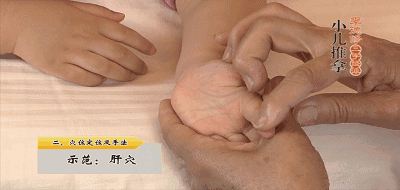
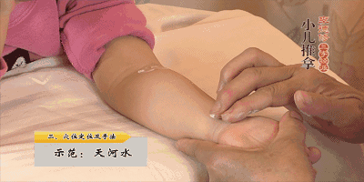
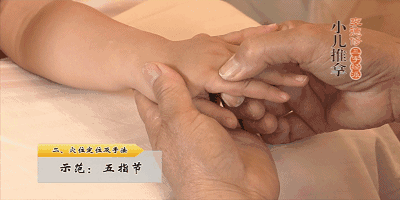
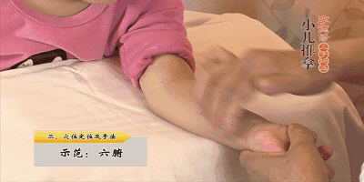
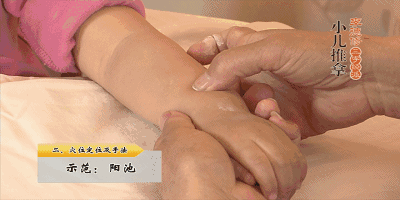
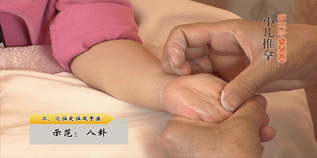
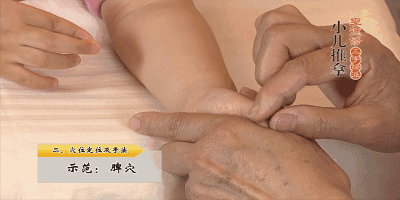
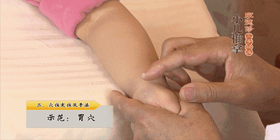

# **小儿一般感冒重感冒积食的推拿手法**

**推拿歌**

心经有热作痴迷，天河水过入洪池。

肝经有病眼多闭，推动脾土病即愈。

脾土有病食不进，推动脾土效必应。

胃经有病食不消，脾土大肠八卦调。

肺经有热咳嗽多，可把肝经六按摩。

肾经有病小便涩，推动肾水可救得。

大肠有病泄泻多，可把大肠用心搓。

小肠有病气来攻，横纹板门精宁通。

命门有病元气虚，脾土大肠八卦推。

三焦有病生寒热，天河六腑神仙决。

膀胱有病作淋漓，肾水八卦云天河。

胆经有病口作苦，只用妙法推脾土。

五脏六腑各有推，千金妙诀传千古。

## 一般感冒治疗

**①平肝10分钟，从小儿食指指根推到指尖。**

平肝能够发散外邪。感冒，中医认为是风寒或风热邪气侵袭体表皮肤，通过推拿这个穴位，能够将入侵身体的风寒、风热邪气发散出体外以治愈疾病。

**②清肺10分钟，从小儿无名指指根推到指尖。**

中医认为肺合皮毛，外邪侵袭皮肤，肺部就会受到影响进而积热，用清肺的方法就能清除肺热，防止感冒咳嗽，并 且能促进皮肤排除邪气。

**③推天河水15分钟。从小儿腕横纹均匀推到肘横纹。**

推天河水能退热，普通感冒发热症状用推天河水的方式就能够解决了。

 **诊断-** **入门察色**

五色多在面，吉凶要观形。

赤红多积热，抽风肝胆惊。

面黄多积食，唇白是寒侵。

青黑没间出，黄粱梦里人。

五声由肺出，肺绝哭无声。

气短咽喉塞，痰多医生惊。

哑声热不退，腹痛冷相侵。

听罢知虚实，存知在耳鸣。

**④掐五指节2~3遍。**

掐五指节可以用于伤风感冒，调和气血。

简简单单四步，妈妈只要找准穴位坚持做完相应时间，就一定会起到效果，很多高烧儿童的体温在短短几十分钟内就能降下来。

**看脸定决**

面黄多积食，青色有惊风。

白色将成痢，伤寒面颊红。

渴来唇带赤，热气眼蒙眬。

痢疾双眉皱，不皱是伤风。

秘诀传千古，观察定凶吉。

## 重感冒

**①平肝、清肺各5分钟。**

平肝以发散外邪

清肺以清除肺热、解表

**②推六腑15分钟**

六腑，为凉穴，推之以清除壮热，清热作用比推天河水更强。

**看指定决**

虎口有三关，紫热红伤寒。

青色是惊风，白色便是疳。

黑即肾伤证，黄色脾困端。

**③掐五指节2~3遍**

掐五指节可以调和气血，抵抗病邪，快速治愈。

**④鼻塞严重者，揉阳池10分钟。**

阳池穴可以治疗头部一切疾病包括鼻塞，且头痛不论寒热虚实皆可以用。

**问食定症决**

好食苦心病，好食酸肝病。

好食甘脾病，好食辛肺病。

好食咸肾病，好食热内冷，好食凉内热。

**⑤咳嗽重者，加八卦10分钟。**

八卦主治胸腹气机不畅导致的咳嗽痰喘、胸闷、食积等。

注意：6个月~2岁婴儿高烧若超过40度可能会引发惊厥，请尽快就医。

## 感冒加食滞

**治法总论**

心善精神爽，言清舌润鲜。

不燥不烦渴，寝寐两安然。

肝善身轻便，不怒不惊顺。

指甲红润色，溲和便不难。

脾善唇滋润，知味善加餐。

大便亦滋润，不稀也不干。

肺善声音响，不喘无嗽痰。

皮肤光润泽，呼吸气息安。

肾善不干热，口和吃不干。

小便清且白，夜卧静如山。

感冒兼乳食停滞者，症见呕吐、腹胀、腹痛、肠鸣。

**①平肝、清肺15分钟。**

清肺以除肺热、解表。

平肝以发散表邪。

**②推天河水10分钟**

推天河水能退热，感冒发热常用穴位之一。

**③清脾10分钟。**

清脾穴能消除积滞，消除胀满，解决食积不消化的内部问题。

**④清胃10分钟，用于呕吐、腹胀者。**

清胃能够治理肚腹胀满，积滞腹痛，恶心呕吐，纳呆等，也是清除食物为本。

**⑤运八卦10分钟**

运八卦能增强中气（脾胃之气），增进消化，消痞化积。

   

小儿推拿好不好，唯有试过方知晓。

感冒发烧咳喘痰，小手一摸疾病跑。

便秘腹泻肠胃差，肚子一揉消化好。

不痛不痒无副效，远离打针和吃药。

虽非当即就痊愈，医院也无一次好。

糖衣输液抗生素，哪个不是半毒药。

小儿本就脾肾弱，何故徒增新烦恼。

若说推拿是骗人，何故央视都说好。

月嫂育婴催乳师，小儿推拿皆略晓。

汝若要说推拿贵，医院费用何曾少。

人力物力和财力，他说多少就多少。

并非医院就不好，大病必须走一遭。

小病小痛来推拿，日常护理健康保。

若你执迷终不悟，遗憾普及没做好。

若你信我技术巧，还你茁壮好宝宝！
