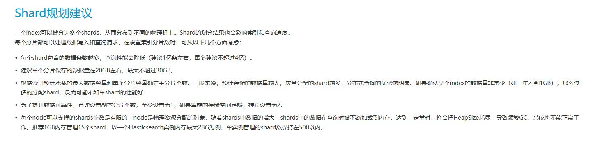

# ES性能指标




240.80:9201最原始的keyword形式使用

```
index shard prirep state        docs   store ip         node
person_pass                 4 p STARTED     886649 426.5mb 172.17.0.2 hdNoAFf
person_pass                 4 r UNASSIGNED                      
person_pass                 3 p STARTED     884847 389.8mb 172.17.0.2 hdNoAFf
person_pass                 3 r UNASSIGNED                      
person_pass                 2 p STARTED     889339 517.2mb 172.17.0.2 hdNoAFf
person_pass                 2 r UNASSIGNED                      
person_pass                 1 p STARTED     886134 667.1mb 172.17.0.2 hdNoAFf
person_pass                 1 r UNASSIGNED                      
person_pass                 0 p STARTED     885724 628.3mb 172.17.0.2 hdNoAFf
person_pass                 0 r UNASSIGNED                                         
```

每条数据0.5KB

## 官方最佳实践（7.x版本）

### 生命周期策略（基于ILM）

+ 索引可以配置以下几种策略：hot、warn、cold、frozen、delete

### 索引

+ 创建索引时尽量包含较长的时间维度，例如以周为维度就好于以日为维度（在数据量允许的情况下）
+ 

### 关于分片

+ 搜索时每个分片一个线程
+ 集群总分片数受到限制
+ 根据索引将要容纳的数据量来计划分片数，过多过少的分片数都会影响查询效率
+ 

可以结合esIndexmgr程序自动创建索引并将索引加入统一的别名中进行使用
