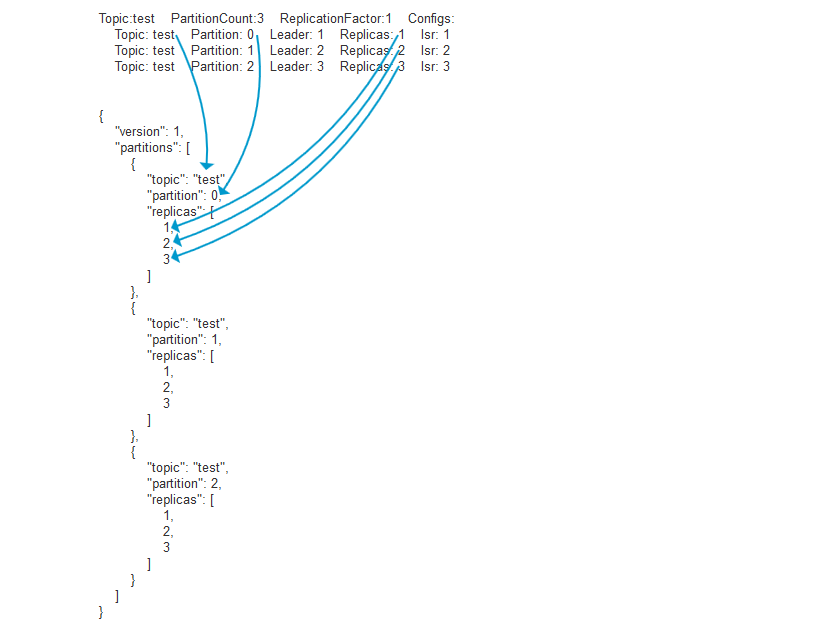

## 惯例

* 为了保证高可用性需要设置不少于2的复制因子，建议3（节点数不能少于复制因子数）。
* 为了保证磁盘空间的可用性，需要设置数据保留时间和数据最大保留体积（至少应该设置最大保留体积）。
* 为了确保可接收大体积消息，需要提前预估并规划好最大的单条消息的体积并在集群节点配置中进行申明，避免超过限制大小无法接收。

## 常用命令

### 设置消费坐标

```
#更新到当前group最初的offset位置
./bin/kafka-consumer-groups.sh --bootstrap-server localhost:9092 --group test-group --reset-offsets --all-topics --to-earliest --execute
#更新到指定的offset位置
./bin/kafka-consumer-groups.sh --bootstrap-server localhost:9092 --group test-group --reset-offsets --all-topics --to-offset 500000 --execute
#更新到当前offset位置（解决offset的异常）
./bin/kafka-consumer-groups.sh --bootstrap-server localhost:9092 --group test-group --reset-offsets --all-topics --to-current --execute
#offset位置按设置的值进行位移
./bin/kafka-consumer-groups.sh --bootstrap-server localhost:9092 --group test-group --reset-offsets --all-topics --shift-by -100000 --execute
#offset设置到指定时刻开始
./bin/kafka-consumer-groups.sh --bootstrap-server localhost:9092 --group test-group --reset-offsets --all-topics --to-datetime 2017-08-04T14:30:00.000
```

## 常用配置

```bash
#设置复制因子为3启用高可用机制
default.replication.factor=3
#数据保留时间
log.retention.hours=10
#数据保留体积(独立于时间策略)100G
log.retention.bytes=107374182400
#单个数据文件最大体积1G
log.segment.bytes=1073741824
#最少保证复制几个副本（小于或等于复制因子数）
min.insync.replicas=2
#单条消息最大体积10MB
message.max.bytes=10485760
#最大队列请求数
queued.max.requests=1024
```

## 动态设置topic的复制因子

### 命令行方式

```bash
#查看topic list
bin/kafka-topics.sh --zookeeper zkaddr:2181 --list
#查看topic detail
bin/kafka-topics.sh --describe --zookeeper zkaddr:2181 --topic test
#输出示例
Topic:test    PartitionCount:3    ReplicationFactor:1    Configs:
    Topic: test    Partition: 0    Leader: 1    Replicas: 1    Isr: 1
    Topic: test    Partition: 1    Leader: 2    Replicas: 2    Isr: 2
    Topic: test    Partition: 2    Leader: 3    Replicas: 3    Isr: 3

#扩容时候需要一个json描述文件，建议用脚本写一个，举例如下（和上述输出有关联关系）
#test.json
{
    "version": 1,
    "partitions": [
        {
            "topic": "test",
            "partition": 0,
            "replicas": [
                1,
                2,
                3
            ]
        },
        {
            "topic": "test",
            "partition": 1,
            "replicas": [
                1,
                2,
                3
            ]
        },
        {
            "topic": "test",
            "partition": 2,
            "replicas": [
                1,
                2,
                3
            ]
        }
    ]
}

#正式执行
bin/kafka-reassign-partitions.sh --zookeeper  zkaddr:2181 --reassignment-json-file test.json --execute
#出现successfully为成功，此时可以再通过`bin/kafka-topics.sh --describe --zookeeper zkaddr:2181 --topic test`查看详情
```



### 使用kafkamgr来动态调整已有主题复制因子

* 依次进入-clusters-你的集群-topics-你的主题，点击Generate Partition Assignments 按钮。
* 在新页面中的Replication factor (optional)项输入你想要的复制因子设置（建议至少3）。
* 点击Generate Partition Assignments 按钮确认。
* 点击  Reassign Partitions 按钮，此时会有个警告，点击Try force running连接允许后会回到当前页面，点击新出现的 Force Reassign Partitions即可。
* 点击Update config 在min.insync.replicas中设置为2点击update config确认
* 整个集群同时只能存在一个replication复制任务，如果要调整的主体较多需要依次调整。